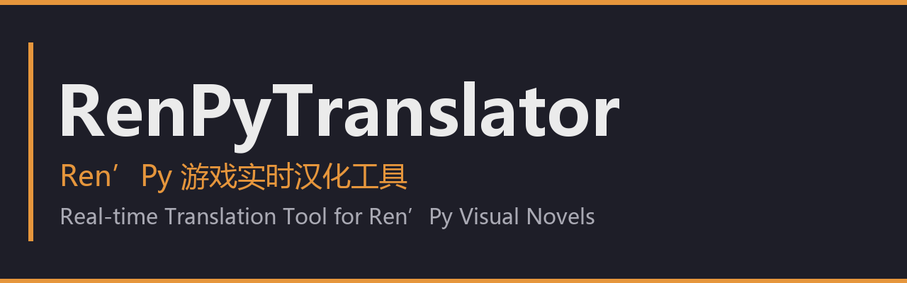

<div align="center">
  
</div>

# 🎮 RenPyTranslator — Real-time Ren'Py Game Localization Tool

> A **Windows desktop localization tool** for Ren'Py visual novels: in-game real-time translation + one-click full-text translation + free/AI dual engines, with multi-language support, percentage-based translation and token cost estimation. An open-source alternative to MTool.

<div align="center">
  <a href="README.md">中文</a> ｜ **English**
</div>

<p align="center">
  <a href="https://github.com/l1234556dd/RenPyTranslator/stargazers"></a>
  <a href="https://github.com/l1234556dd/RenPyTranslator/forks"></a>
  <a href="https://github.com/l1234556dd/RenPyTranslator/releases"></a>
  
  
  
  
</p>

---

## ✨ Features

| Feature | Description |
|---|---|
| 🚀 **Real-time in-game translation** | Injects into the Ren'Py game process; dialogue is translated on the fly without leaving the game |
| 📚 **One-click full translation** | Automatically extracts all game text → estimates tokens/cost → confirmation dialog → translates everything into the local cache |
| 🎚️ **Percentage translation** | Translate the first 10%/25%/50%… to preview quality before translating more — saves money and stays in control |
| 🆓 **Free fast engine** | Google web translation (free, ~1s/line, multi-line batching ~17x faster), MyMemory auto-fallback |
| 🤖 **AI high-quality engine** | DeepSeek / OpenAI / Qwen / Kimi / Ollama and other OpenAI-compatible APIs for more natural translations |
| 🔤 **Multi-language** | Simplified Chinese / Traditional Chinese / English / Japanese / Korean / Russian / Spanish / French / German |
| 💾 **Local persistent cache** | Translations stored in local SQLite; each line is translated once and reused forever — across games and restarts |
| 📊 **Usage statistics** | Real-time prompt/completion token usage and cache hit rate |
| 📖 **Glossary** | Fixed translations for names/places to keep terminology consistent |
| 🖼️ **CJK font fix** | Auto-replaces game fonts with a Chinese font so translations display correctly instead of "□□□" |

## 🚀 Quick Start

### Option 1: Prebuilt executable (recommended)

1. Download `RenPyTranslator.exe` from [Releases](https://github.com/l1234556dd/RenPyTranslator/releases) (single file, double-click to run, no Python required)
2. First launch: fill in the game directory → choose a translation engine → click **Start Game & Translate**
3. User data (config/translation cache) lives in `%APPDATA%\RenPyTranslator\` — delete the folder to uninstall

### Option 2: Run from source

```bash
# Dependencies (Python 3.11+)
pip install PySide6 requests

# Launch the desktop UI
python translator/app.py

# CLI: start game & translate
python main.py --game "D:\game\your_renpy_game" --engine llm
```

## 📖 Recommended Workflow

```
1. Start Game & Translate   → game opens, translator auto-injects
2. Translate whole game     → all text extracted, dialog shows estimated tokens/cost
3. Pick engine + ratio      → Google free fast (0 cost) / AI high-quality; 10%~100%
4. Confirm translation      → everything translated into the local cache
5. Relaunch the game        → full Chinese instantly, zero waiting
```

> 💡 **Money-saving tip**: use the free Google engine for the bulk (no tokens spent), then switch to the AI engine for lines where machine quality is poor. Already-translated lines are cached forever and never re-billed.

## ⚙️ Configuration

### Translation engines

| Engine | Speed | Cost | Quality | Notes |
|---|---|---|---|---|
| Free fast (Google) | ~1s/line | Free | Machine | No API key needed |
| AI high-quality (LLM) | 2-8s/line | Per token | Natural | DeepSeek/OpenAI/Qwen/Kimi/Ollama |
| mock | Instant | Free | — | Offline testing |

### Supported providers (OpenAI-compatible)

DeepSeek / OpenAI / Qwen / Kimi (Moonshot) / Ollama (local) / custom

## 🏗️ Architecture

```
┌─────────────────────────────────────────────────┐
│  RenPyTranslator (PySide6 desktop)              │
│  ├─ engines.py    (llm / free / mock)           │
│  ├─ cache.py      (SQLite + glossary + stats)   │
│  ├─ server.py     (TCP threaded translation)    │
│  ├─ injector.py   (ctypes process injection)    │
│  └─ launcher.py   (launch game + inject)        │
└──────────────┬──────────────────────────────────┘
               │ localhost TCP (JSON line protocol)
┌──────────────▼──────────────────────────────────┐
│  Game process (Ren'Py)                           │
│  └─ gamehook/hook.py                             │
│     ├─ config.replace_text   replace before show │
│     ├─ config.say_callback   prefetch next line  │
│     ├─ placeholder protection §N§                │
│     └─ font replacement      CJK rendering fix   │
└─────────────────────────────────────────────────┘
```

## 📁 Repository Layout

```
renpy-translator/
├── main_gui.py              # packaging entry
├── main.py                  # CLI entry
├── translator/
│   ├── app.py               # PySide6 desktop UI
│   ├── engines.py           # engines: llm / free(Google) / mock
│   ├── cache.py             # SQLite cache + glossary + usage stats
│   ├── server.py            # TCP translation server
│   ├── batch.py             # batch translation (multi-line batching)
│   ├── launcher.py          # game launch + injection
│   ├── paths.py             # path management (per-game cache dirs)
│   └── config.py            # configuration
├── gamehook/hook.py         # in-game hook (injected into the game)
├── injector/injector.py     # ctypes injector
├── tools/                   # helper tools (text extraction etc.)
└── 使用说明书.md            # detailed usage guide (Chinese)
```

## 🔨 Build the exe from source

```bash
pip install pyinstaller PySide6-Essentials
python -m PyInstaller --noconfirm --clean --onefile --windowed \
  --icon icon.ico --name RenPyTranslator \
  --add-data "gamehook;gamehook" --add-data "injector;injector" \
  --add-data "tools;tools" --hidden-import requests main_gui.py
```

> ⚠️ The software includes "process injection for translation" — antivirus may flag it. Please add an exclusion if needed.

## 📄 License

This project is open-sourced under the [MIT License](LICENSE).

## ⚠️ Disclaimer

- For **personal learning and legal localization** use only
- Do not use to bypass DRM / anti-cheat systems
- Translated text is the intellectual property of the original game publishers; do not distribute translated game content
- Use of Google's free translation interface is at your own discretion; please comply with the relevant terms of service
